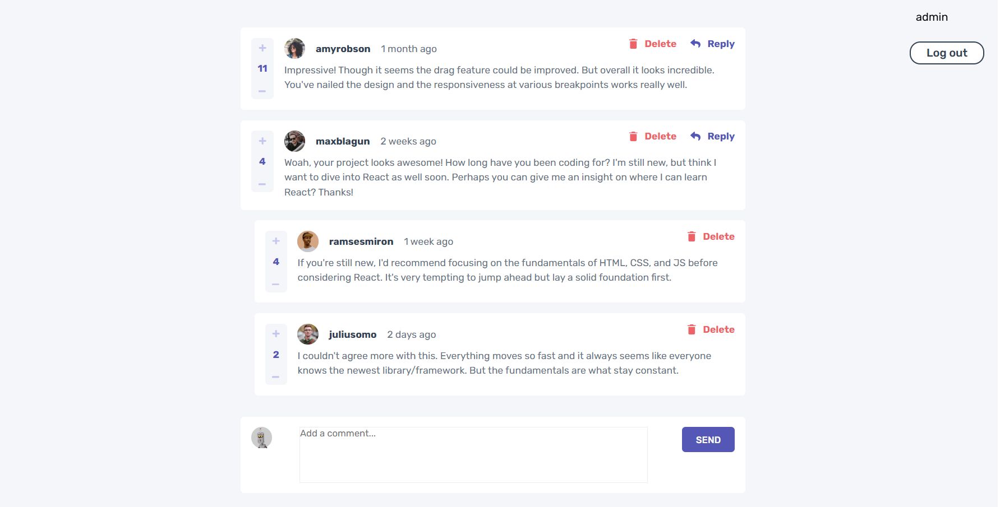

# Frontend Mentor - Interactive comments section solution

This is a solution to the [Interactive comments section challenge on Frontend Mentor](https://www.frontendmentor.io/challenges/interactive-comments-section-iG1RugEG9). Frontend Mentor challenges help you improve your coding skills by building realistic projects.

Project was created only for desktop view. Project was a little modified and some additional functionalities were added:

-   register
-   login/logout
-   remember me option

## Table of contents

-   [Overview](#overview)
    -   [The challenge](#the-challenge)
    -   [Screenshot](#screenshot)
-   [My process](#my-process)
    -   [Built with](#built-with)
-   [Author](#author)

## Overview

### The challenge

Users should be able to:

-   See hover states for all interactive elements on the page
-   Create, Read, Update, and Delete comments and replies
-   Upvote and downvote comments
-   **Bonus**: If you're building a purely front-end project, use `localStorage` to save the current state in the browser that persists when the browser is refreshed.
-   **Bonus**: Instead of using the `createdAt` strings from the `data.json` file, try using timestamps and dynamically track the time since the comment or reply was posted.

### Screenshot

## My process

### Built with

-   HTML5
-   [Sass(SCSS)](https://sass-lang.com/)
-   Flexbox
-   JavaScript
-   REST API
-   [JSON-Server](https://www.npmjs.com/package/json-server) - for storing comments, users and current user
-   [BEM](https://getbem.com/) - for CSS class naming
-   [Robots](https://robohash.org/) - for users' photos
-   [Font: Rubik from Google Fonts](https://fonts.google.com/specimen/Rubik)

## Author

-   Website - [DDM-projects](https://github.com/DDM-projects)
